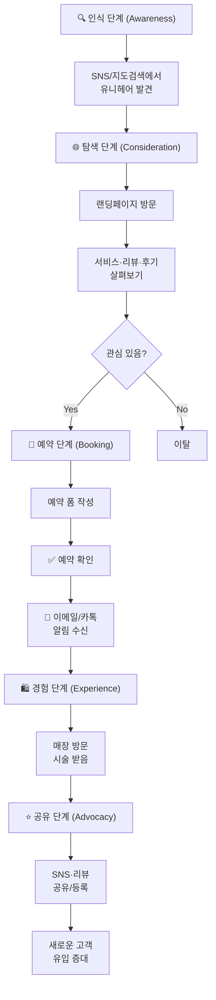
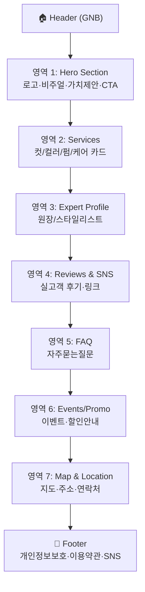
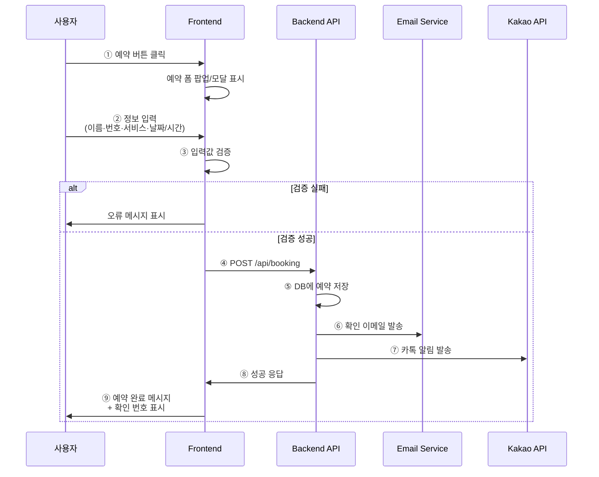
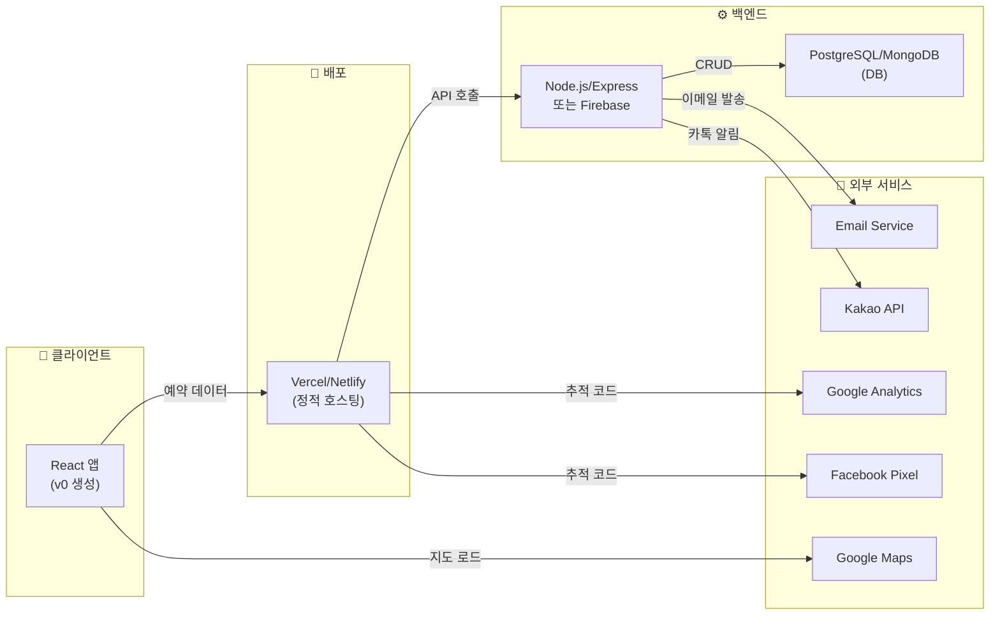
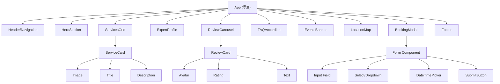
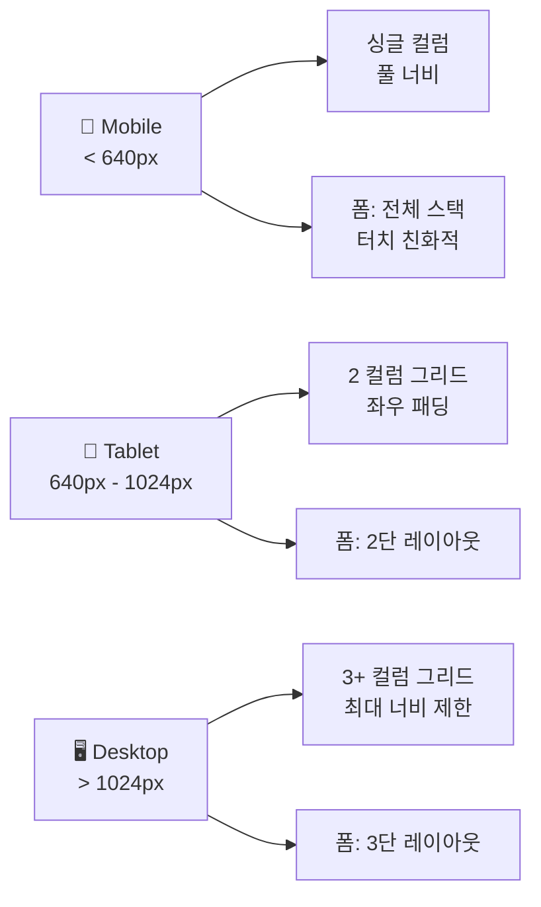
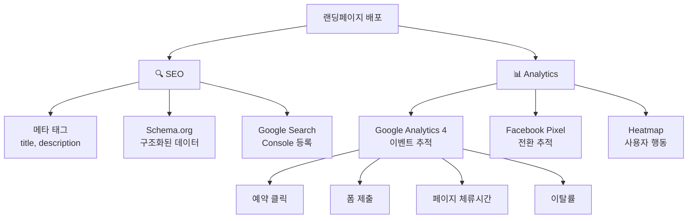
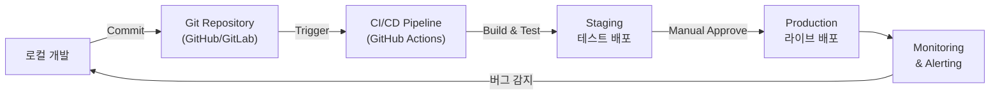

# Mermaid.md - UNIHAIR 랜딩페이지 다이어그램

## 1. 사용자 여정 맵 (User Journey Map)

## 2. 페이지 구조 및 섹션 흐름 (Page Structure)

## 3. 예약 플로우 (Booking Flow)

## 4. 시스템 아키텍처 (System Architecture)

## 5. 컴포넌트 계층도 (Component Hierarchy)

## 6. 반응형 디자인 브레이크포인트 (Responsive Design)

## 7. SEO & 분석 연동 (SEO & Analytics)

## 8. 배포 및 모니터링 (Deployment & Monitoring)

